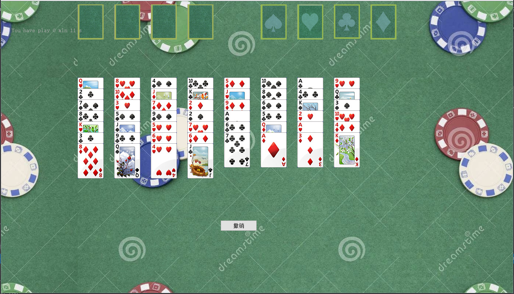
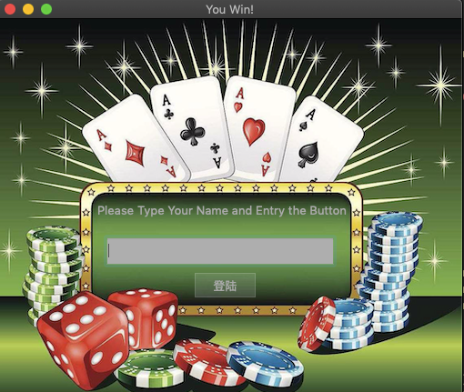
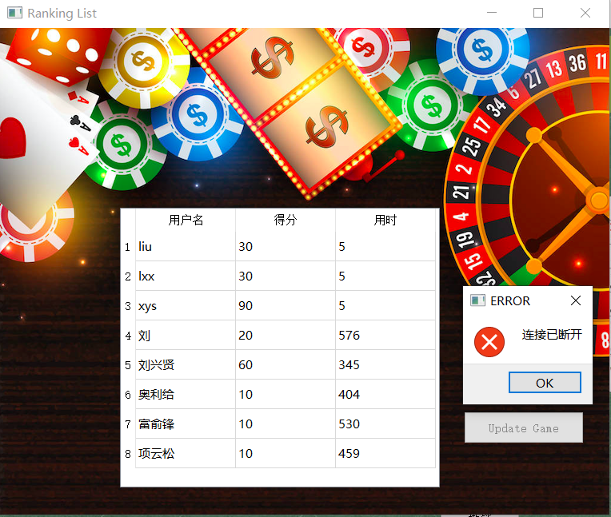

# -FreeCell-
这是一个基于C++、Qt实现的空当接龙小游戏，可供参考 
至于空当接龙的游戏规则，详见[FreeCell](https://en.wikipedia.org/wiki/FreeCell) 
 
文件 空当接龙 下是游戏程序源代码 
文件 CardGameServer 是记录程序排名的服务器 
**如有程序相关的问题，请邮件联系我，乐意与您探讨** 
我的邮箱 lxx13273780760@outlook.com 
 
主界面： 

积分界面 
 
 

